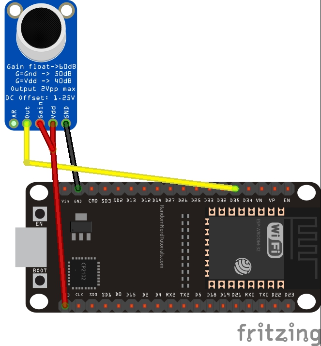
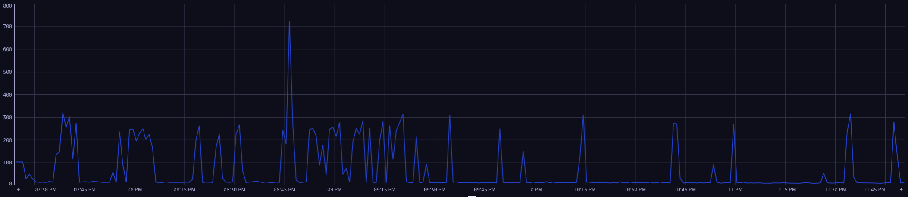

# Bark Detector

A system that detects and monitors dog barks using an ESP32 microcontroller with a MAX9814 microphone amplifier. Bark power measurements are published over MQTT, collected by a Go backend, and shipped as OpenTelemetry metric for real-time monitoring and visualisation.

## Hardware

### Components

| Component | Description |
|---|---|
| ESP32 | Dual-core microcontroller with built-in WiFi |
| MAX9814 Microphone Amplifier | Electret microphone with automatic gain control (AGC), connected to ESP32 ADC pin 35 |

### Wiring Diagram



### Time Series (4 hours)

The chart below shows `bark_power` in a 4-hour window, where barking periods appear as visible spikes in the time series.



### Connections

| MAX9814 Pin | ESP32 Pin |
|---|---|
| VDD | 3.3V |
| GND | GND |
| OUT | GPIO 35 (ADC) |
| GAIN | Leave floating (default 40 dB gain) |

### Setup

1. Copy the example config file:
   ```bash
   cp include/config.example.h include/config.h
   ```
2. Edit `include/config.h` and fill in your credentials:
   ```cpp
   char wifi_ssid[]         = "YOUR_WIFI_SSID";
   char wifi_password[]     = "YOUR_WIFI_PASSWORD";
   const char mqtt_broker[] = "YOUR_RASPBERRY_PI_IP";
   const char sensor_id[]   = "esp32-mic-01"; // unique per device
   ```
3. Flash with PlatformIO:
   ```bash
   pio run --target upload
   ```

### MQTT Payload Format

The ESP32 publishes to the topic `bark/metrics` with the format:
```
<epoch_seconds>|<sensor_id>|<rms_value>
```
Example: `1711180800|esp32-mic-01|12.3400`

A measurement is computed as the RMS of 100 ADC samples (~every 500 ms at a 5 ms loop delay).

### What is RMS and why use it?

RMS means **Root Mean Square**. It is a standard way to represent the effective magnitude (energy level) of a signal that oscillates around zero, like microphone audio.

For a window of $N$ samples $x_1, x_2, ..., x_N$:

$$
\mathrm{RMS} = \sqrt{\frac{1}{N}\sum_{i=1}^{N} x_i^2}
$$

We use RMS for bark metrics because it:

- captures sound intensity (signal power) better than a simple average,
- avoids positive and negative waveform cancellation,
- smooths short spikes by using a sample window,
- gives a stable, comparable value over time for thresholding and alerting.

In this project, each published value is the RMS of 100 ADC samples, so the `bark_power` metric reflects recent bark loudness in a robust way.

### Configuration

Create a `.env` file at the project root (it is git-ignored):

```env
DT_TENANT=your-tenant-id       # e.g. abc12345
DT_API_TOKEN=dt0c01.XXXX.YYYY  # Dynatrace API token
```

The `DT_TENANT` value is the subdomain of your Dynatrace environment:
- SaaS: `https://<DT_TENANT>.live.dynatrace.com`
- Sprint: `https://<DT_TENANT>.sprint.dynatracelabs.com`

### Running

```bash
# First run (or after code changes)
docker compose up --build

# Subsequent runs
docker compose up

# Run in background
docker compose up -d

# Stop
docker compose down
```

### Metrics

The Go backend exports a single gauge metric every **10 seconds**:

| Metric | Unit | Attribute |
|---|---|---|
| `bark_power` | RMS | `sensor.id` |
